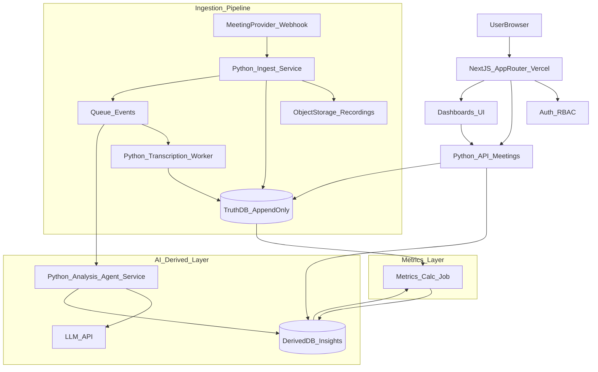

# Part 1 — Meeting Ingestion & Intelligence (System Design)

This is the design for the truthOS meeting-ingestion feature: a cloud-native setup using Next.js (App Router), TypeScript, Python services, LLM APIs, agent-based analysis, and Vercel.

## Goals

We want to ingest meetings (recordings and transcripts) for sales and coaching orgs, tie that activity to contacts and to revenue/outcomes, and produce metrics and bounded AI insights. There should be one source of truth: immutable activity records, with derived data kept separate. We also need RBAC, auditability, and cost controls.

## High-level architecture diagram

Below: high-level flow (user → Next.js → Python API; ingestion pipeline → TruthDB; analysis agent → LLM → DerivedDB; metrics job; dashboards). A separate data-flow diagram with the same flow is in the repo as [data-flow.drawio](data-flow.drawio) (open in [draw.io](https://app.diagrams.net/)).

## Truth vs derived data

We split data into two layers.

Truth is immutable: meeting occurrence, participants, raw transcript (or segments), recording refs, timestamps, ingestion metadata. It lives in an append-only store (TruthDB). We never overwrite it; corrections are new records (e.g. a TranscriptCorrection event) with a full audit trail.

Derived is everything that comes from processing: LLM extraction, summaries, classifications, sentiment, metric rollups, baselines. It goes into DerivedDB. Every derived row is tagged with model, promptVersion, schemaVersion, inputHash, and analyzedAt so we can trace it back.

## Key services and responsibilities

Next.js on Vercel runs the operator/member UI, calls the backend APIs, and renders dashboards. The UI doesn’t duplicate reporting logic—it reads from derived tables that are built from truth.

The Python Meetings API exposes read endpoints for contacts and meetings and write endpoints that only append to truth. It enforces RBAC.

The ingestion service takes webhooks from meeting providers (Zoom, Google Meet), stores recording pointers, and pushes events to a queue. The transcription worker turns recordings into transcripts (provider transcript or ASR), appends transcript records, and emits “transcript ready.” The analysis agent does bounded, deterministic extraction from transcripts into structured JSON and writes to the derived store. A metrics job computes contact-centric rollups (e.g. conversion signals, coaching adherence, baselines) from truth and derived data and writes back into the derived store.

## Contact-centric model (conceptual)

Truth tables (append-only):

- Contact(id, orgId, createdAt, ...)
- Meeting(id, orgId, contactId, type, occurredAt, createdAt, source, ...)
- MeetingTranscript(meetingId, version, transcriptText, createdAt, contentHash, source)
- RevenueEvent(id, orgId, contactId, type=payment|refund, amount, occurredAt, createdAt)
- OutcomeEvent(id, orgId, contactId, kind, occurredAt, createdAt, evidenceRef)

Derived tables:

- MeetingAnalysis(meetingId, schemaVersion, model, inputHash, topics, objections, commitments, sentiment, outcome, summary, analyzedAt)
- ContactMetrics(contactId, windowStart, windowEnd, metricKey, value, computedAt, inputsHash)
- Baselines(orgId, metricKey, cohortKey, value, computedAt, inputsHash)

## Data flow (meeting → metrics → agents → dashboards)

1. A meeting is created in truth via provider webhook or manual ingest (Meeting record).
2. The recording is stored as a pointer (URL or object key); we don’t mutate it.
3. Transcription appends a row to MeetingTranscript with contentHash.
4. The analysis agent reads the transcript, calls the LLM with a strict JSON schema, and stores MeetingAnalysis in the derived store.
5. The metrics job aggregates by contactId from truth and derived, and persists ContactMetrics.
6. Dashboards: Next.js fetches meetings and analyses per contact and shows raw truth separately from derived insights.

## APIs (conceptual)

- POST /api/meetings — append meeting and transcript (truth)
- POST /api/meetings/{meetingId}/analyze — operator-only; writes derived analysis
- GET /api/contacts/{contactId}/meetings — truth and derived for the UI
- GET /api/contacts/{contactId}/metrics?window=30d — derived rollups
- GET /api/audit?entity=meeting&entityId=... — append-only audit trail

## RBAC

Roles (simplified): operator (can ingest, run analysis, view raw transcripts); member/basic (limited meeting metadata and derived summaries; transcript access can be masked or off).

Enforcement: JWT/session carries orgId, userId, role. All writes are org-scoped; the analysis endpoint requires operator. The public results layer is a separate read path with anonymization (see below).

## Auditability and truth enforcement

Truth tables are append-only; the app layer doesn’t do updates or deletes. Every derived row points back to its input via inputHash (transcript content + meeting id + prompt version). We store who/when/how (createdBy, createdAt, source, requestId). Optionally we keep an AuditLog stream for every write with before/after references (no mutation of history).

## Cost awareness

Analysis runs async via a queue so we only run it when needed (including “analyze on demand”). We cache analysis by (meetingId, transcriptHash, schemaVersion, promptVersion, model). On the LLM side we use transcript chunking and deterministic summarization, cap tokens, and use a bounded output schema. Metric recomputation is batched, with incremental updates by event type where it helps.

## Public results layer (conceptual)

We only publish aggregated metrics (e.g. by cohort or time window) and enforce k-anonymity. We drop direct identifiers, use rotated salts for pseudonymous keys, and use coarse time bucketing. We reduce re-identification risk by suppressing small cohorts, adding noise where acceptable, and limiting how many dimensions can be filtered.

## Assumptions and tradeoffs

We assume Postgres for both truth and derived stores (same cluster with separate schemas is fine). Recordings go to object storage; transcripts can live in the DB for hashing and auditing or in object store with a hash pointer. A queue (e.g. SQS, Redis, Upstash) keeps async transcription and analysis simple and helps with cost. The strict split between truth and derived adds a bit of complexity but keeps LLM output out of the source of truth.
